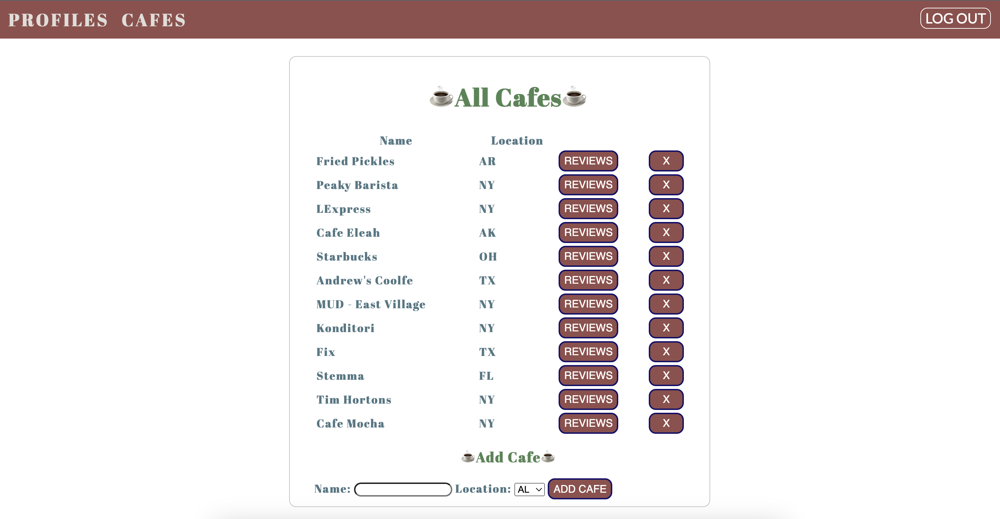

# Caffeinate-Me

## [☕ Caffeinate-Me](https://caffeinate-me.fly.dev)

## 🏃🏻‍♀️ Getting Started
"Caffeinate-Me" was inspired by my love of coffee.  I love going to family-owned cafes around the United States.  I drink 8 cups of coffee a day. I love speaking with fellow coffee-lovers about our love of coffee.

"Caffeinate-Me" lets you add your favorite cafes, review cafes, and edit your reviews.  You will no longer have to scroll through your notes app to remember the cafe you saw five months ago.  Caffeinate yourself as you add more cafes to "Caffeinate-Me!"

Planning materials and original wireframes can be found [here](https://trello.com/b/M4Np6xbo/caffeinate-me)

## ✍🏻 Attributions

* [MDN](https://www.w3schools.com/)
* [W3Schools](https://www.w3schools.com/)
* [Giphy](https://giphy.com/gifs/hoppip-coffee-time-adventure-687qS11pXwjCM)
* [Giphy](https://giphy.com/gifs/coffee-the-devil-wears-prada-miranda-priestly-xUOrwpPFzqDh48XEek)
* [Giphy](https://giphy.com/gifs/oZEBLugoTthxS)
* [Giphy](https://giphy.com/gifs/originals-retro-l46Cbqvg6gxGvh2PS)
* [Giphy](https://giphy.com/gifs/coffee-monday-3D1v8iexqiPbq)
* [Giphy](https://giphy.com/gifs/season-15-the-simpsons-15x22-3orif4JrJbG1J4X9Ze)
* [Soft Icons](https://www.softicons.com/toolbar-icons/32x32-free-design-icons-by-aha-soft/coffee-icon)

## 🖥️ Technologies Used
* Mongoose
* MongoDB
* Node.js
* Express
* JavaScript
* CSS
* Git
* Google OAuth
* Fly.io
* EJS
* Animate.css

## 🧊 Ice Box
- [x] Implement friend request functionality.
- [ ] Add meet-ups for each cafe.
- [ ] Show meet-ups that each profile is attending.
- [ ] Let users save a bio in their profile.
- [ ] Allow users to add photos to their reviews.
- [ ] Create a different page when a user has not logged cafes into the database.

